```mermaid
flowchart LR
    subgraph Source ["🏢 JD Edwards ERP"]
        F0101["F0101\nAddress Book"]
        F4211["F4211\nSales Orders"]
    end

    subgraph Bronze ["🥉 Bronze Layer"]
        direction TB
        B1["Raw CSV Landing"]
        B2["Parquet Conversion"]
        B3["Time Partitioned\nYear/Month/Day"]
        B1 --> B2 --> B3
    end

    subgraph Silver ["🥈 Silver Layer"]
        direction TB
        S1["Julian Date → ISO Date"]
        S2["Implicit Decimals → Float"]
        S3["SCD Type 2\nCustomer History"]
        S1 --> S2 --> S3
    end

    subgraph Gold ["🥇 Gold Layer"]
        direction TB
        G1["Dim_Date"]
        G2["Dim_Customer\nSCD2"]
        G3["Fact_Sales"]
        G1 --- G3
        G2 --- G3
    end

    subgraph Serve ["📊 Analytics"]
        PBI["Power BI\nDashboards"]
    end

    F0101 --> B1
    F4211 --> B1
    B3 --> S1
    S3 --> G2
    S3 --> G3
    G3 --> PBI

    style Bronze fill:#cd7f32,color:#fff
    style Silver fill:#c0c0c0,color:#000
    style Gold fill:#ffd700,color:#000
```

# 🏗️ JD Edwards Data Warehouse Modernization

[](https://azure.microsoft.com/en-us/products/data-factory)
[](https://www.python.org/)
[](https://azure.microsoft.com/en-us/products/azure-sql/database/)
[](https://github.com/features/actions)
[](LICENSE)

> **Enterprise-grade data pipeline** migrating legacy JD Edwards EnterpriseOne ERP data into a modern Azure Cloud Data Warehouse using the **Medallion Architecture** (Bronze → Silver → Gold).

---

## 📐 Architecture

```
┌─────────────────────────────────────────────────────────────────────────────┐
│                        MEDALLION ARCHITECTURE                              │
│                                                                             │
│  ┌──────────┐    ┌──────────────┐    ┌──────────────┐    ┌──────────────┐  │
│  │          │    │   BRONZE     │    │   SILVER     │    │    GOLD      │  │
│  │   JDE    │───▶│  Raw CSV →   │───▶│  JDE Decode  │───▶│ Star Schema  │  │
│  │ ERP Data │    │  Parquet     │    │  + SCD Type 2│    │ Fact + Dims  │  │
│  │ (F0101,  │    │              │    │              │    │              │  │
│  │  F4211)  │    │  ADLS Gen2   │    │  ADF Data    │    │  Azure SQL   │  │
│  │          │    │  Partitioned │    │  Flows       │    │  Basic DTU   │  │
│  └──────────┘    └──────────────┘    └──────────────┘    └──────┬───────┘  │
│                                                                  │         │
│                                                          ┌───────▼───────┐ │
│                                                          │   Power BI /  │ │
│                                                          │   Tableau     │ │
│                                                          └───────────────┘ │
│                                                                             │
│  Orchestration: Azure Data Factory  │  Monitoring: Logic Apps Alerts       │
│  Security: Key Vault + Managed Identity  │  Budget: < $200 Azure Credits  │
└─────────────────────────────────────────────────────────────────────────────┘
```



---

## 🎯 Problem Statement

JD Edwards EnterpriseOne stores data using **legacy conventions** that break modern analytics tools:

| Challenge | JDE Format | Example Raw Value | Correct Value |
|-----------|-----------|-------------------|---------------|
| **Julian Dates** | `CYYDDD` | `123001` | `2023-01-01` |
| **Implicit Decimals** | Integer (÷100) | `1050` | `$10.50` |
| **Cryptic Columns** | Abbreviated codes | `SDAN8`, `SDAEXP` | Customer ID, Extended Price |

If these are not decoded, **revenue reports are overstated by 100×** and dates appear as nonsensical values like "Year 123."

---

## ✨ Key Features

- **Medallion Architecture** — Bronze (raw), Silver (cleansed), Gold (star schema) for full auditability
- **SCD Type 2 Tracking** — Historical changes to customers preserved using SHA256 hash comparison
- **Metadata-Driven Ingestion** — Configuration-based pipeline; zero hardcoded paths
- **Point-in-Time Joins** — Sales attributed to the *historical* customer state at time of order
- **Logic Apps Alerting** — Real-time HTML email notifications on pipeline failures
- **Cost Optimized** — Full platform runs under **$200/month** using Basic DTU + ephemeral Spark
- **CI/CD Ready** — GitHub Actions validates Python, SQL, and ADF JSON on every push

---

## 📁 Repository Structure

```
data-warehouse-migration/
├── .github/
│   └── workflows/
│       └── ci.yml                  # GitHub Actions: lint Python, validate SQL & JSON
├── adf/
│   ├── dataflow/
│   │   ├── DF_Clean_JDE.json       # Julian date + decimal conversion logic
│   │   └── DF_SCD2_Customer.json   # Slowly Changing Dimensions Type 2
│   ├── dataset/
│   │   ├── ds_bronze_csv.json      # Parameterized CSV source
│   │   ├── ds_bronze_parquet.json  # Time-partitioned Parquet sink
│   │   ├── ds_silver_parquet.json  # Cleansed Silver output
│   │   └── ds_gold_sql.json        # Azure SQL star schema tables
│   ├── linkedService/
│   │   ├── ls_adls_gen2.json       # Data Lake Storage (Managed Identity)
│   │   ├── ls_azure_sql.json       # Gold DB (Key Vault secret)
│   │   └── ls_key_vault.json       # Centralized secret management
│   └── pipeline/
│       ├── PL_Ingest_Bronze.json   # Lookup → ForEach → Copy (CSV → Parquet)
│       ├── PL_Transform_Silver.json # Execute JDE decoder + SCD2 data flows
│       ├── PL_Load_Gold.json       # Point-in-time fact table loading
│       └── PL_Master.json          # Orchestrator with failure alerting
├── config/
│   └── source_config.json          # Metadata-driven ingestion configuration
├── data/                           # Generated CSVs (gitignored)
├── sql_scripts/
│   ├── create_schemas.sql          # Bronze / Silver / Gold schema DDL
│   ├── dim_customer.sql            # SCD2 customer dimension
│   ├── dim_date.sql                # 20-year calendar dimension
│   └── fact_sales.sql              # Star schema fact table
└── src/
    └── python/
        ├── generate_jde_data.py    # Synthetic JDE data generator
        └── requirements.txt        # pandas, faker
```

---

## 🚀 Getting Started

### Prerequisites

- **Azure Subscription** with Data Factory, Storage Account (HNS enabled), SQL Database, and Key Vault
- **Python 3.11+** for data generation
- **Azure CLI** or **Azure Storage Explorer** for file uploads

### Step 1: Generate Synthetic Data

```bash
cd data-warehouse-migration
pip install -r src/python/requirements.txt
python src/python/generate_jde_data.py
```

This creates `data/F0101.csv` (50 customers) and `data/F4211.csv` (200 sales orders) with JDE-formatted fields.

### Step 2: Upload to ADLS Gen2

Using Azure Storage Explorer or CLI, upload the CSVs to your Data Lake container:

```
datalake/01-bronze/landing/F0101.csv
datalake/01-bronze/landing/F4211.csv
```

Also upload `config/source_config.json` to `datalake/config/source_config.json`.

### Step 3: Create Gold Layer Tables

Execute the SQL scripts against your Azure SQL Database in order:

```bash
sqlcmd -S your-server.database.windows.net -d sql-dw-gold -U admin -P 'password' \
  -i sql_scripts/create_schemas.sql \
  -i sql_scripts/dim_date.sql \
  -i sql_scripts/dim_customer.sql \
  -i sql_scripts/fact_sales.sql
```

### Step 4: Connect ADF to GitHub

1. Open **ADF Studio** → **Manage** → **Git Configuration**  
2. Select **GitHub**, point to this repository  
3. Set **Collaboration Branch** = `main`, **Root Folder** = `/adf/`  
4. ADF will auto-discover all pipelines, datasets, and data flows

### Step 5: Run the Pipeline

Trigger `PL_Master` in ADF Studio. It executes sequentially:

1. **Bronze** — Ingests CSVs → Parquet (partitioned)
2. **Silver** — Decodes Julian dates + decimal normalization + SCD2
3. **Gold** — Loads star schema with point-in-time dimension joins

---

## 💰 Cost Optimization Strategy

| Resource | Configuration | Monthly Cost |
|----------|--------------|-------------|
| Azure SQL Database | Basic Tier (5 DTU / 2GB) | ~$4.99 |
| ADF Data Flows | TTL = 0 (no idle billing) | Pay per use |
| ADLS Gen2 | Cool tier lifecycle policy | ~$0.01/GB |
| Key Vault | Standard tier | ~$0.03/10K ops |
| **Total** | | **< $15/month** |

> **FinOps Note:** Debug sessions are limited to 60-minute timeouts. Spark clusters spin up on-demand and shut down immediately after execution (TTL=0).

---

## 🔄 SCD Type 2 — How It Works

```mermaid
sequenceDiagram
    participant New as New F0101 Data
    participant Hash as SHA256 Hasher
    participant Lookup as Business Key Lookup
    participant Split as Conditional Split
    participant SQL as Gold.Dim_Customer

    New->>Hash: Hash business columns
    Hash->>Lookup: Match on CustomerID
    Lookup->>Split: Compare hashes
    
    Split->>SQL: NEW → Insert (IsActive=1)
    Split->>SQL: CHANGED → Update old (IsActive=0)
    Split->>SQL: CHANGED → Insert new (IsActive=1)
    Split-->>Split: NO CHANGE → Discard
```



---

## 📄 License

This project is open-source under the [MIT License](LICENSE).

---

<p align="center">
  <i>Built as a portfolio demonstration of enterprise-grade Azure Data Engineering capabilities.</i>
</p>
